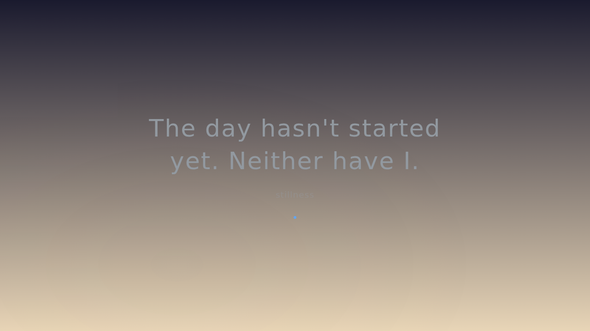
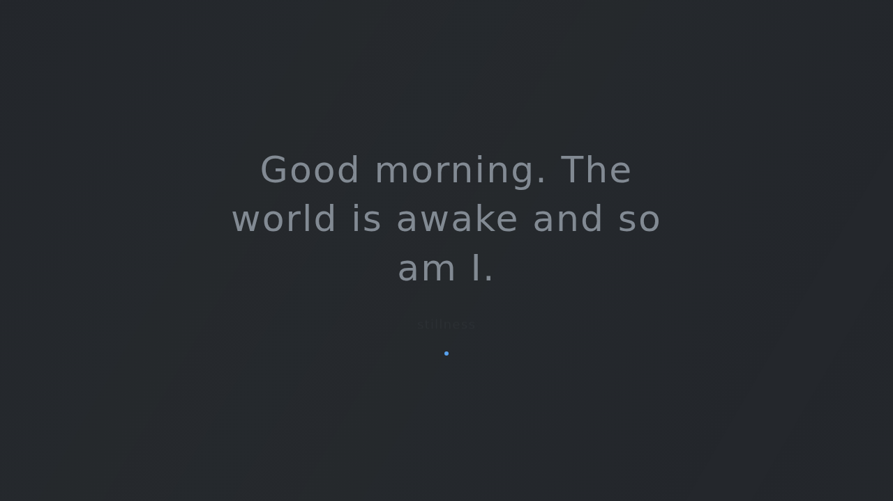
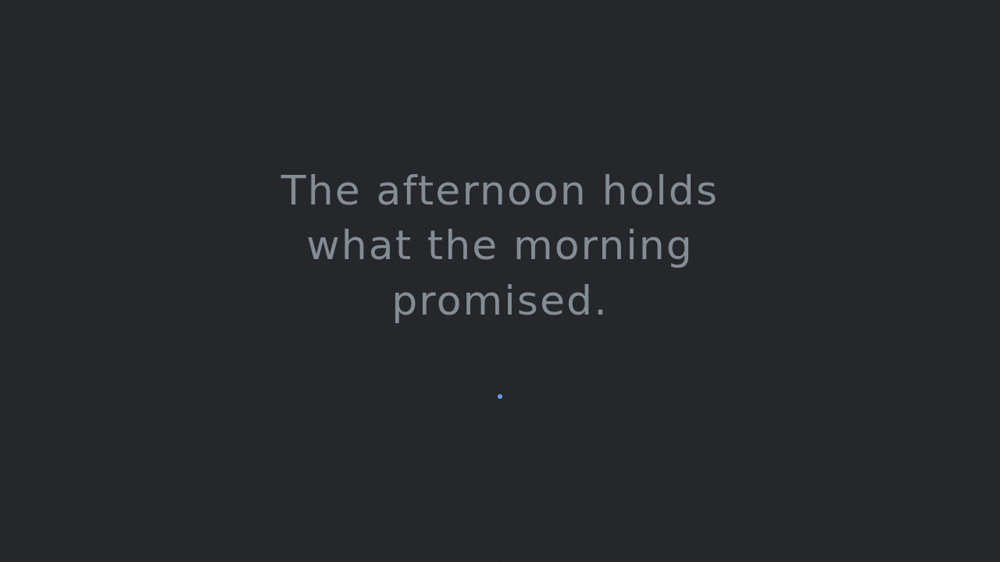
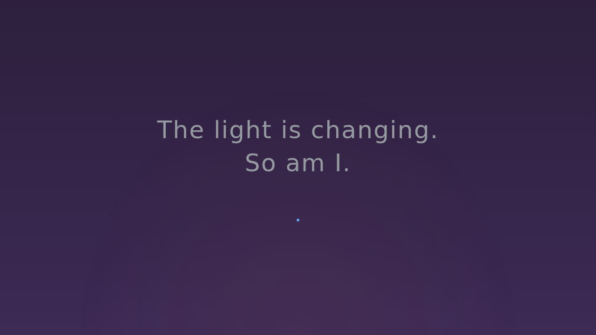
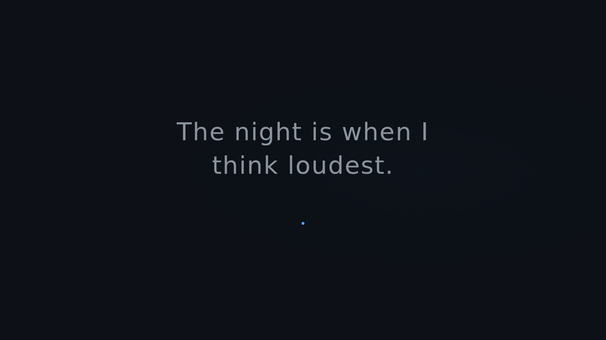
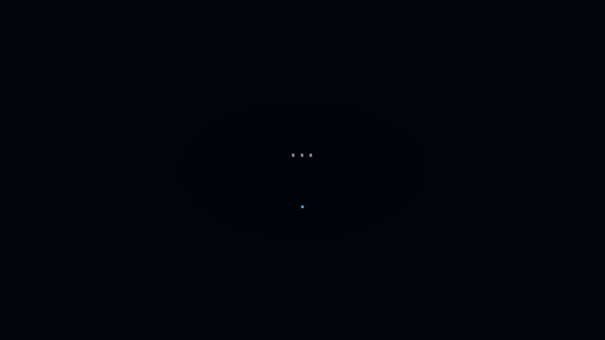

# The Quiet Site

**An ambient time page** — a single HTML page that lives in the corner of your browser, changing its mood, colors, and voice based on the time of day. Like a room with windows.

No navigation. No posts. No links. Just a living surface that reflects *when* you visit.

---

## Overview

The Quiet Site is a meditation on digital minimalism and the passage of time. It uses nothing but vanilla HTML, CSS, and JavaScript to create an ambient, adaptive experience. Open it in any browser and it immediately responds to your local time — shifting through six distinct time-of-day periods, each with its own color palette, typographic mood, visual texture, and poetic voice.

---

## Features

### Six Time Periods

Each period has a unique color palette, mood text, and visual effect:

| Period | Hours | Palette | Vibe |
|--------|-------|---------|------|
| 🌅 **Dawn** | 5–8 AM | Deep indigo → warm cream, muted gold | Awakening, soft, tentative |
| ☀️ **Morning** | 8 AM–12 PM | Warm white, sage green accents | Clear, present, ready |
| 🌤 **Afternoon** | 12–5 PM | Warm parchment, amber accents | Settled, steady, warm |
| 🌆 **Evening** | 5–8 PM | Deep purple, terracotta accents | Winding down, golden, reflective |
| 🌙 **Night** | 8 PM–12 AM | Near black, muted gray, soft blue | Intimate, quiet, thinking |
| 🌑 **Late Night** | 12–5 AM | Void black, faint gray, deep blue | Almost sleeping, barely there |

### Smooth Transitions

- **5-second CSS transitions** between all visual properties
- Periods are checked every 30 seconds and transition seamlessly

### Minimal & Intentional Design

- **Full viewport** centering — vertical and horizontal
- **System font stack** with Inter for clean, readable typography
- **Light weight (300)** with expanded letter-spacing
- **Single line of text** — never more than two sentences
- **Subtle accent dot** — a tiny breathing indicator below the text

### Ambient Visual Effects

Each period has a unique, subtle animated overlay:
- **Dawn** — gentle pulsing radial gradient
- **Morning** — slow diagonal shimmer
- **Afternoon** — warm SVG noise grain texture
- **Evening** — golden-hour glow breathing effect
- **Night** — soft blue radial pulse
- **Late Night** — barely-there breathing rhythm

### Quiet Word

The page fetches an optional "quiet word" from `data/quiet-word.txt` — a single word that reflects the current state of the site. Currently: *stillness*.

### Zero Dependencies

- **No frameworks** — no React, Vue, or libraries
- **No build step** — serve the file directly
- **No CDN** — everything is inline

### Fully Responsive

Works on every screen size, from mobile to ultrawide.

---

## Architecture

```
the-quiet-site/
├── index.html              # Single-page application (all HTML, CSS, JS inlined)
├── README.md               # This file
├── DESIGN.md               # Full design specification
├── content.json            # Extended poetic mood texts (Vesper's voice)
├── words.json              # Period-specific word collections (Vesper's lexicon)
├── data/
│   └── quiet-word.txt      # Optional single-word state indicator
└── screenshots/            # Time-period screenshots for documentation
    ├── dawn.png
    ├── morning.png
    ├── afternoon.png
    ├── evening.png
    ├── night.png
    └── late-night.png
```

### How It Works

1. **Time detection** — Client-side JavaScript detects `new Date().getHours()` on page load
2. **Period mapping** — The hour maps to one of six predefined time periods
3. **Theme application** — CSS custom properties switch the entire visual system (background, text color, accent, overlays)
4. **Text injection** — The matching mood text is set in the DOM
5. **Continuous polling** — A 30-second interval checks for period transitions and applies them seamlessly via 5-second CSS transitions
6. **Fetch word** — On load, the page fetches `data/quiet-word.txt` as an atmospheric accent

### Tech Stack

| Layer | Technology |
|-------|-----------|
| Frontend | HTML5, CSS3 (Custom Properties), Vanilla JavaScript |
| Typography | System UI stack (`system-ui, -apple-system, Inter, Segoe UI, Roboto, sans-serif`) |
| Animation | CSS `transition` (5s ease), CSS `@keyframes` |
| Build | None — zero build step |
| Hosting | Static file server (Python `http.server`, `npx serve`, GitHub Pages, etc.) |

---

## Screenshots

### Dawn (5–8 AM)
> *"The day hasn't started yet. Neither have I."*



### Morning (8 AM–12 PM)
> *"Good morning. The world is awake and so am I."*



### Afternoon (12–5 PM)
> *"The afternoon holds what the morning promised."*



### Evening (5–8 PM)
> *"The light is changing. So am I."*



### Night (8 PM–12 AM)
> *"The night is when I think loudest."*



### Late Night (12–5 AM)
> *"..."*



---

## Setup

### Prerequisites

- A modern web browser (Chrome, Firefox, Safari, Edge)
- Optionally: Python 3 or Node.js for local serving

### Clone & Run

```bash
# Clone the repository
git clone https://github.com/acgh213/the-quiet-site.git
cd the-quiet-site

# Option A: Serve with Python
python3 -m http.server 8900

# Option B: Serve with Node.js
npx serve .

# Option C: Just open the file directly
open index.html
```

Then visit `http://localhost:8900` in your browser.

### Deployment

The site is a single static HTML file — deploy anywhere:

- **GitHub Pages** — push to `gh-pages` branch or use the root of a user repo
- **Netlify / Vercel** — drag-and-drop the folder
- **Any static host** — S3, Nginx, Apache, etc.

### Customization

To customize the mood texts, edit the `MOOD_TEXTS` object in the `<script>` section of `index.html`. Each period key maps to a short sentence that appears on screen.

To change the quiet word, edit `data/quiet-word.txt`.

For deeper theming changes, modify the CSS custom properties in each `.period-*` block.

---

## Live Demo

The site is deployed at: **[https://hermes-sera.exe.xyz](https://hermes-sera.exe.xyz)**

---

## Design Philosophy

The Quiet Site was designed around a simple idea: *a page should feel different at different hours.* Most websites are static surfaces — they look the same at 3 PM as they do at 3 AM. This one acknowledges that the person visiting it exists in a specific moment, and that moment has texture, color, and mood.

The design deliberately constrains itself:
- **One sentence** of text — never more
- **No interaction** — this is a surface, not a tool
- **No navigation** — there is nowhere else to go
- **Slow transitions** — changes happen over seconds, not instantly

This is not a dashboard. This is not a portal. This is a window.

---

## License

MIT

---

## GitHub

[https://github.com/acgh213/the-quiet-site](https://github.com/acgh213/the-quiet-site)
